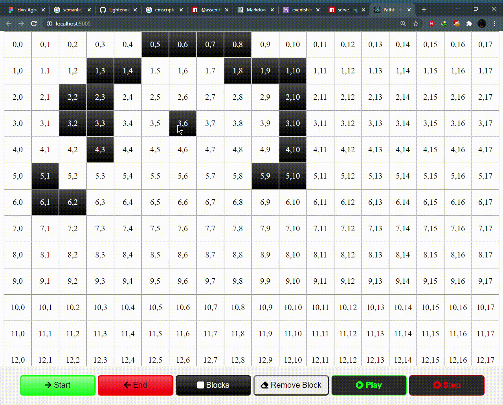
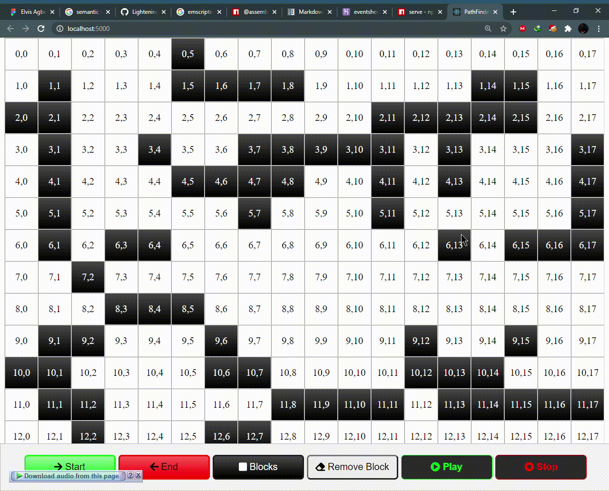
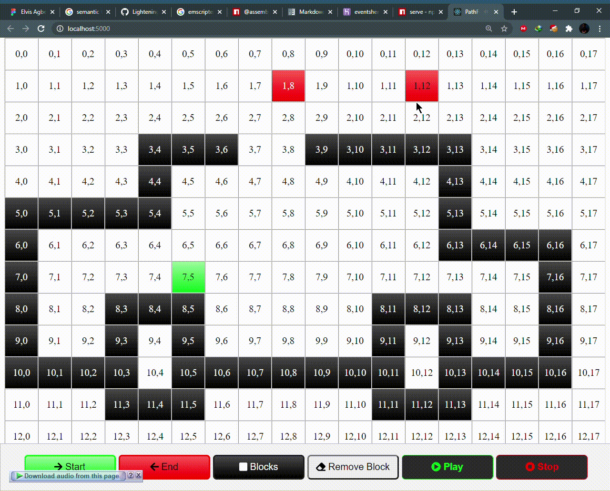
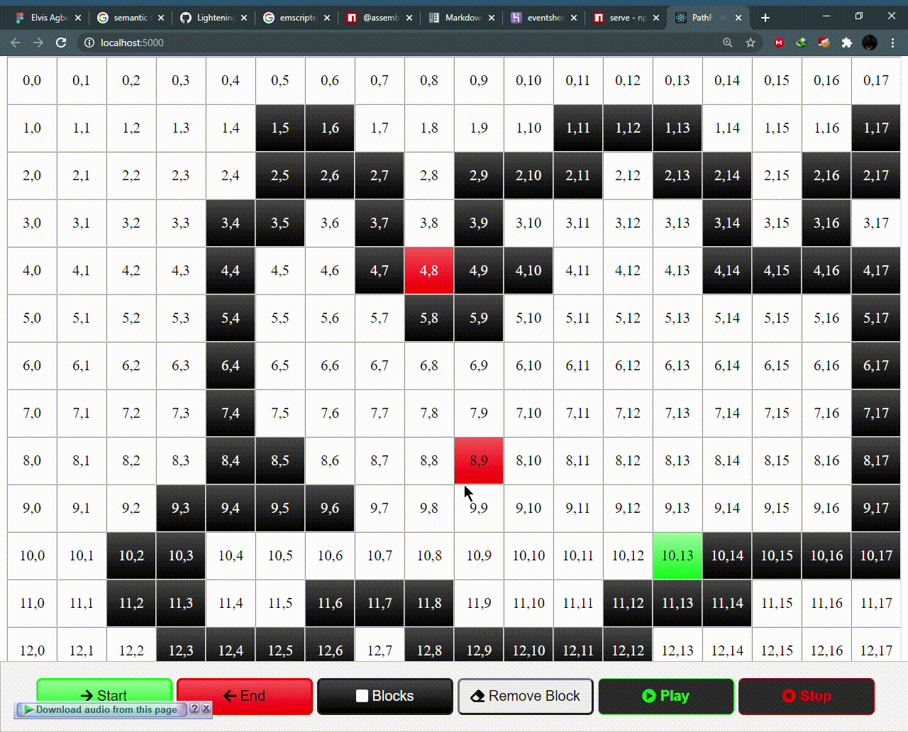
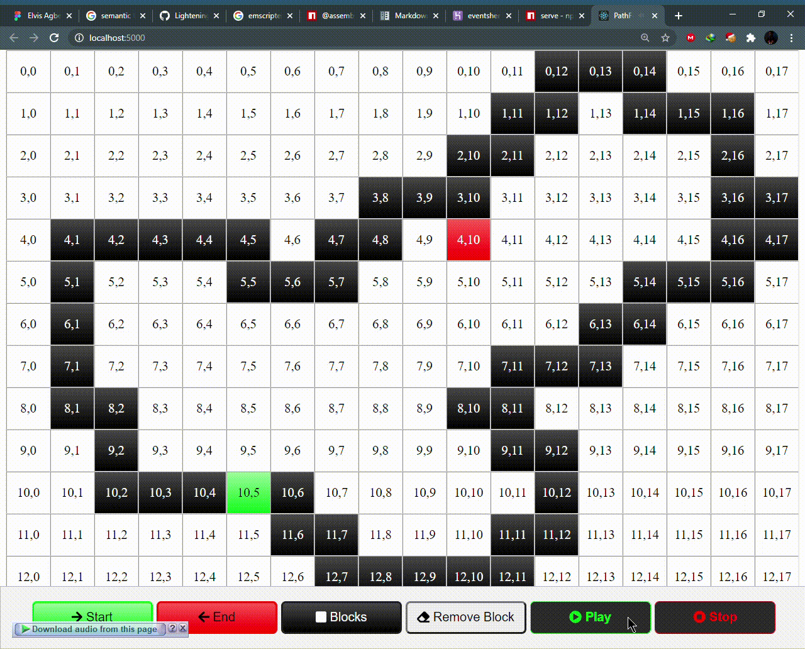
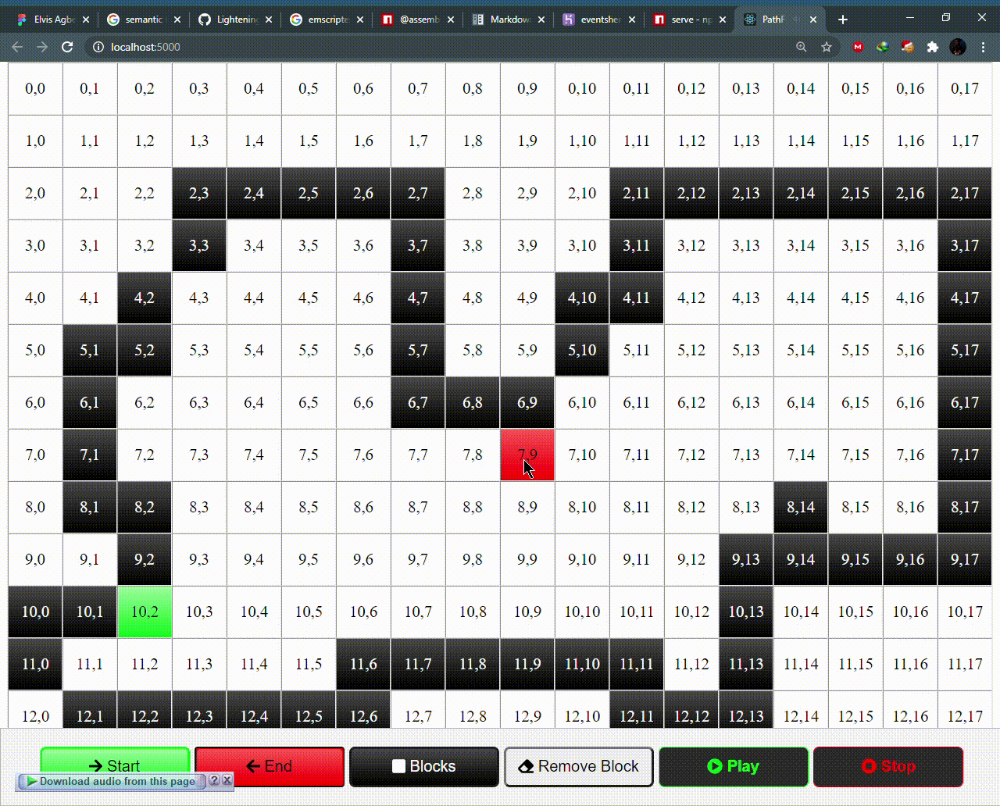

# JavaScript-PathFinder
An program that uses JavaScript to do some path finding, no ‎Dijkstra's algorithm or any of the popular path finding, just plain reasoning. It was fun to be honest. Just seeing it work made me smile.

### What can this do?
----------

##### You can create blocks

  

##### Then press play to do the path finding

Example 1

Example 2

##### It leaks through edges tho 

##### And some exceptional cases it doesnt work

Example 1

Example 2

###### What I think about this
When i find time ill try to understand what I have built, sometimes when I go back to look at the code I cant event remember what I did for this to work.

The only thing I know for sure, and I remember that made the path finding a little faster was using the `WeakSet` data structure to prevent duplicates

Apart from that. I am literally blank on what actually happened when i was building it.
